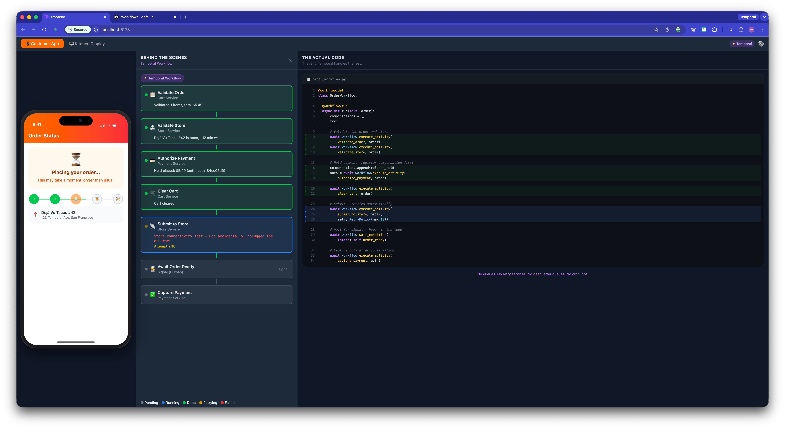
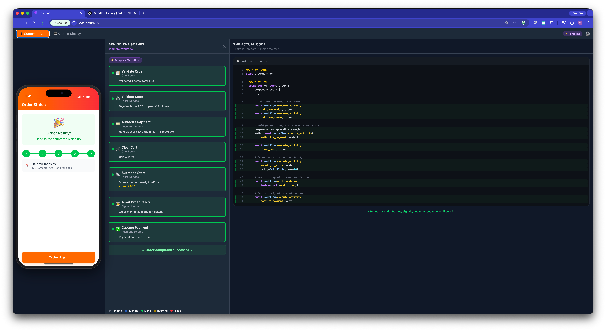
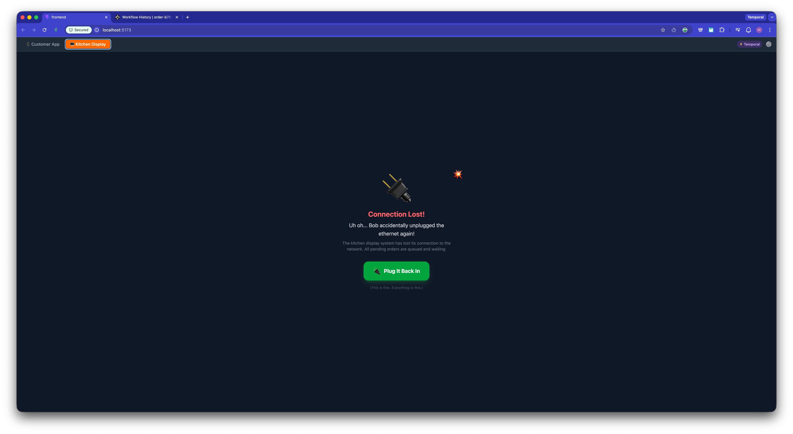
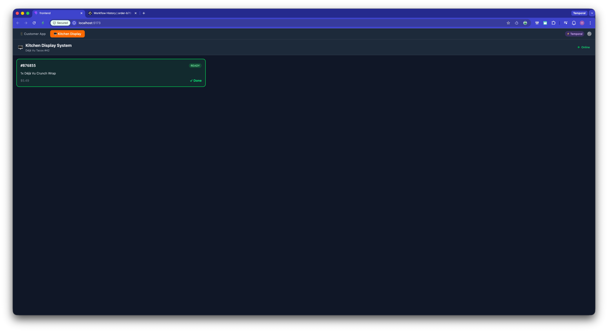
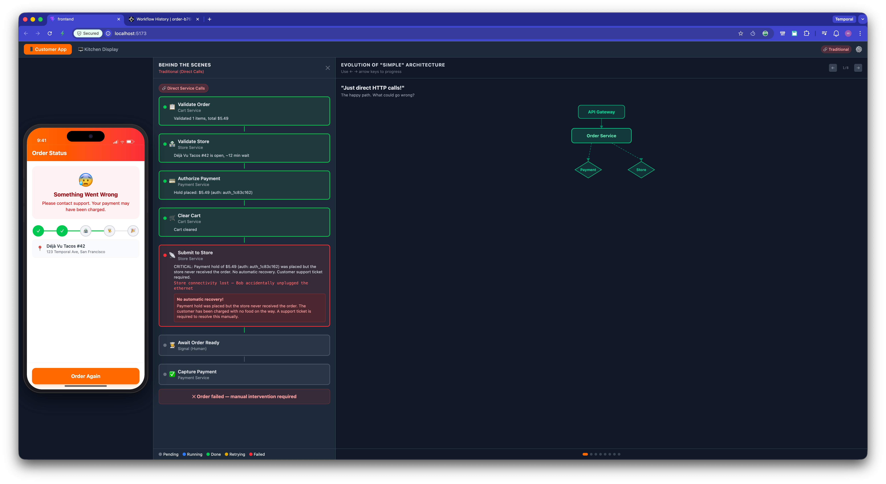
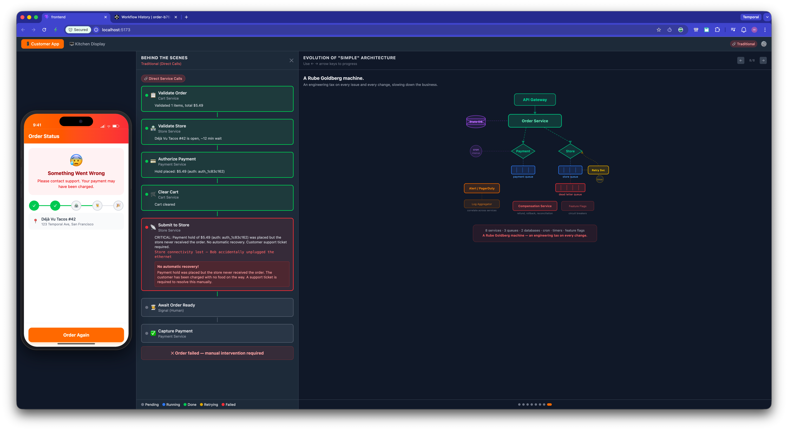
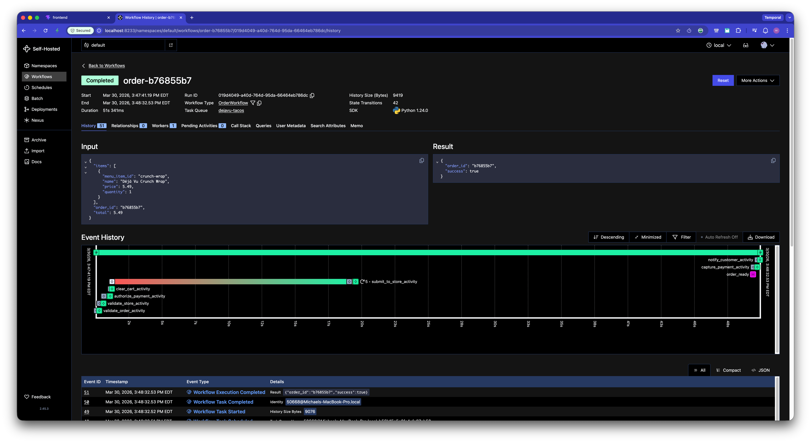

# Déjà Vu Tacos — Temporal Order Management Demo

A live, interactive demo showing why [Temporal](https://temporal.io) matters for order management. Place a taco order through an iPhone-style app, watch the behind-the-scenes workflow execute in real time, and see what happens when things go wrong.

Toggle between **Traditional mode** (direct service calls, no recovery) and **Temporal mode** (durable workflows with retries, signals, and compensation) — same failure, wildly different outcomes.



## Quick Start

**Prerequisites:** [Temporal CLI](https://docs.temporal.io/cli) + either Docker or ([uv](https://docs.astral.sh/uv/) + [Node.js](https://nodejs.org/))

```bash
./scripts/start.sh           # Python worker (default)
./scripts/start.sh java      # Java worker (coming soon)
```

The script auto-detects your environment:

| Has Docker? | What happens |
|---|---|
| Yes | Temporal CLI on host, backend/worker/frontend in containers |
| No | Everything runs locally as background processes |

Open http://localhost:5173 once it's running. Temporal UI at http://localhost:8233.

## The Demo

### 1. Place an order (Temporal mode)

Browse the menu, add items, and check out. The behind-the-scenes panel shows each workflow activity executing. The code panel on the right shows the actual workflow code lighting up in real time.



### 2. Simulate a failure

With the default "Store Connectivity" failure scenario, the store loses connection after payment is authorized. Switch to the **Kitchen Display** tab to see what happened:



Click **"Plug It Back In"** — the Temporal workflow's retry policy picks up the recovery automatically. The order appears on the KDS, and you can mark it ready:



### 3. Compare with Traditional mode

Switch to Traditional mode in settings (gear icon) and place the same order. When the store goes down, the order fails — payment is taken but no food is coming. No retries, no compensation, no recovery.



### 4. See the architecture contrast

Use the **arrow keys** to step through the "Evolution of Simple Architecture" diagram, showing the Rube Goldberg machine of queues, retry services, dead letter queues, state databases, and cron jobs that you'd need to build for reliability without Temporal.



### 5. Inspect the real workflows

The Temporal UI at http://localhost:8233 shows actual workflow executions with full event history:



## Settings

Click the gear icon to configure:
- **Architecture Mode**: Traditional (fragile) vs Temporal (durable)
- **Failure Scenario**: Store connectivity (default), payment error, random chaos, or none
- **Presentation Mode**: Simple (high-level) vs Detailed (retries, payloads, error messages)

## Architecture

```
Browser (React + Vite + nginx)
    ↓ REST + SSE
FastAPI Backend (Python)
    ├── Mock Services (payment, store, cart)
    ├── Internal API (failure state, SSE event push, store orders)
    └── Temporal client (starts workflows, sends signals)
           ↕
Temporal Dev Server (CLI, on host)
           ↕
Worker (Python — swappable per language)
    ├── OrderWorkflow (saga compensation, signals, queries)
    └── Activities → Mock Services → Backend internal API
```

The worker runs as a separate process from the backend. Mock services call the backend's internal API for failure state and store order registration, so the worker can be killed and restarted without losing sync — demonstrating Temporal's recovery.

## Project Structure

```
├── frontend/            # React + Vite + TypeScript + Tailwind
├── backend/             # FastAPI + mock services (always Python)
├── workflows/
│   ├── python/          # Temporal workflows & activities
│   ├── java/            # Future
│   ├── go/              # Future
│   └── dotnet/          # Future
├── docker/              # Dockerfiles + nginx config
├── docker-compose.yml   # Container orchestration
└── scripts/start.sh     # One-command launcher
```

The workflow implementations are separated by language so additional SDK flavors (Java, Go, .NET) can be added without changing the backend or frontend.

## Development

```bash
# Install dependencies
uv sync && cd frontend && npm install

# Run individual services
temporal server start-dev --db-filename temporal.db                              # Temporal on :7233
uv run --package dejavu-tacos-backend server                                     # FastAPI on :8000
DEJAVU_BACKEND_URL=http://localhost:8000 uv run --package dejavu-workflows worker # Worker
cd frontend && npm run dev                                                       # Vite on :5173

# Or combined backend + worker in one process (simpler, no env var needed)
uv run --package dejavu-workflows demo
```

## Order Flow

1. **Validate Order** — check items and prices
2. **Validate Store** — confirm store is open
3. **Authorize Payment** — place a hold (not a capture)
4. **Clear Cart** — commit the order
5. **Submit to Store** — send to kitchen (retries on failure)
6. **Await Order Ready** — signal from KDS (human in the loop)
7. **Capture Payment** — charge only after store confirms

**Compensation (saga pattern):** If store submission fails permanently, the workflow automatically releases the payment hold and notifies the customer. No manual intervention needed.
